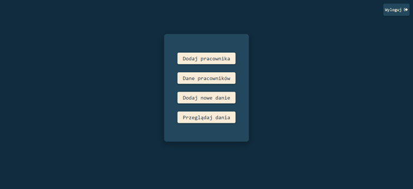
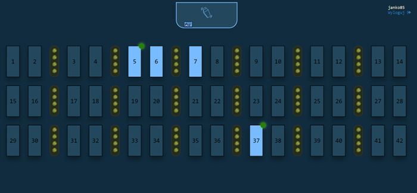
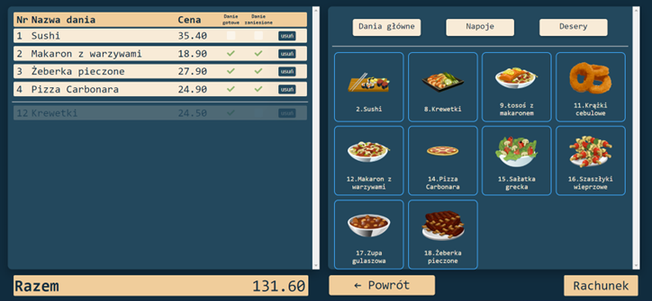
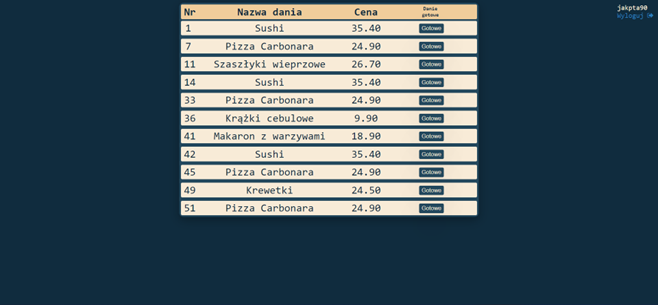
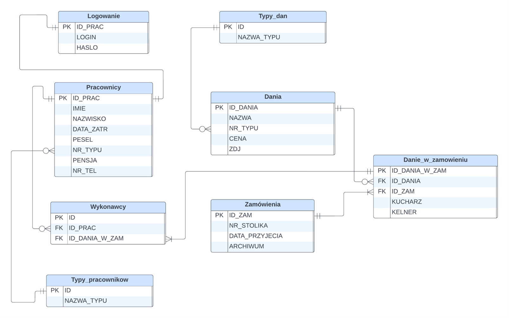
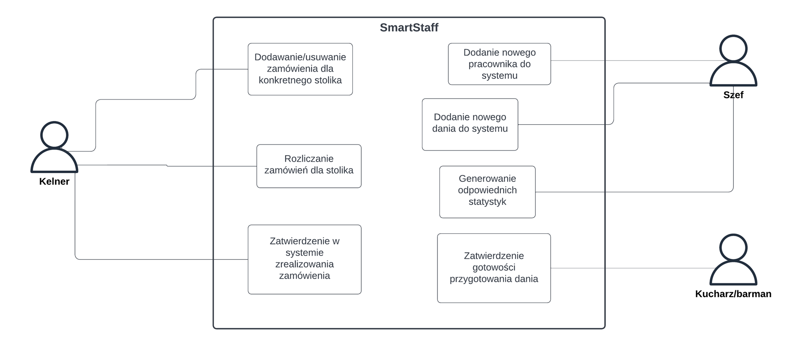

# SmartStaff

**SmartStaff** to aplikacja wspomagająca organizację pracy w lokalach gastronomicznych. Jest stworzona w technologii HTML, CSS, PHP i JavaScript. Aplikacja umożliwia sprawną obsługę zamówień i zarządzanie personelem, dzięki podziałowi na role i automatyzacji procesów kuchennych oraz barowych.

## Funkcjonalności

Aplikacja oferuje różne możliwości w zależności od typu konta. Dostępne role to: **Szef**, **Kucharz**, **Barman** oraz **Kelner**. Poniżej znajdziesz szczegółowy opis funkcji dostępnych dla każdej roli:

### 1. Szef
- **Zarządzanie daniami**: Dodawanie nowych pozycji do menu, łącznie z możliwością dodania zdjęć, które są automatycznie optymalizowane pod kątem rozmiaru.
- **Zarządzanie pracownikami**: Dodawanie nowych pracowników do systemu z przypisaniem roli oraz zdjęciem, które również jest automatycznie zmniejszane.
- **Raportowanie**: Podgląd liczby sprzedanych sztuk poszczególnych dań w danym miesiącu oraz liczby zamówień obsłużonych przez każdego pracownika w wybranym okresie.

<div style="text-align: center;">
  
</div>

### 2. Kelner
- **Wprowadzanie zamówień**: Kelnerzy mogą dodawać zamówienia dla stolików, przy czym dania są automatycznie przypisywane do kucharzy, a napoje do barmanów.
- **Monitorowanie zamówień**: Kelner widzi wszystkie zamówienia, przy czym te wprowadzone przez innych kelnerów są wyszarzone dla lepszej przejrzystości.
- **Powiadomienia o gotowości**: Po przygotowaniu dania przez kucharza lub barmana, kelner odpowiedzialny za zamówienie otrzymuje powiadomienie o gotowości.

  

### 3. Kucharz i Barman
- **Realizacja zamówień**: Podział dań oraz napojów między kucharzy i barmanów w celu efektywnego przygotowania zamówienia.
- **Powiadomienia**: Po ukończeniu przygotowania dania lub napoju, osoba odpowiedzialna oznacza danie jako gotowe, co generuje powiadomienie dla odpowiedniego kelnera.



## Struktura Bazy Danych

Aplikacja korzysta z relacyjnej bazy danych. Poniżej znajduje się schemat bazy danych przedstawiający główne tabele i relacje między nimi.

 

## Diagram Przypadków Użycia

Diagram przypadków użycia ilustruje interakcje między poszczególnymi użytkownikami a systemem, umożliwiając lepsze zrozumienie funkcjonalności i przepływu informacji w aplikacji.

 

## Technologie

- **HTML5** i **CSS3**: Frontend aplikacji, odpowiadający za warstwę wizualną i interfejs użytkownika.
- **JavaScript**: Używany do obsługi dynamicznych elementów strony i interakcji z użytkownikiem.
- **PHP**: Backend aplikacji, odpowiedzialny za logikę biznesową i przetwarzanie danych.
- **MySQL**: Baza danych przechowująca informacje o użytkownikach, daniach, zamówieniach, itp.

## Instalacja

1. **Skopiuj repozytorium**:
   ```bash
   git clone https://github.com/your-username/SmartStaff.git


